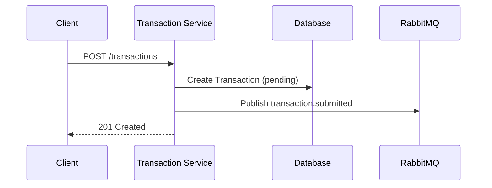
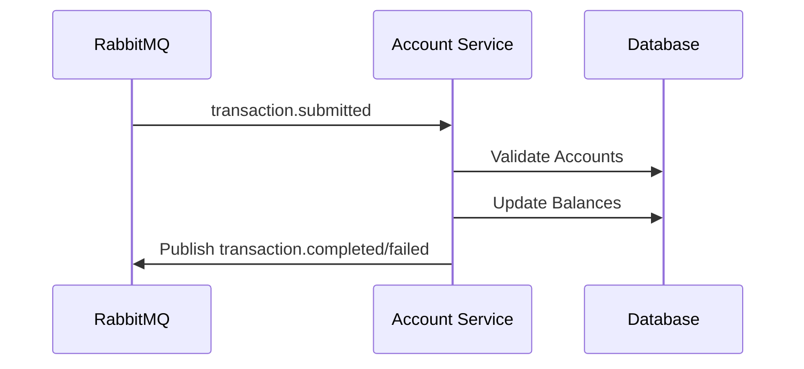
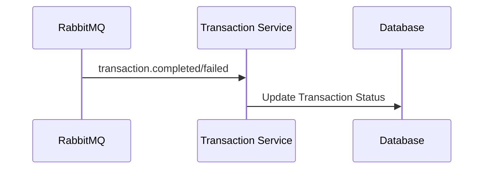

# Internal Transfers System

A microservices-based system for handling internal financial transfers between accounts.

## Features

### Implemented
- Account management (creation and balance queries)
- Transaction processing between accounts
- Event-driven architecture using RabbitMQ
- API Gateway for unified access
- Swagger documentation for all APIs
- Reliable transaction processing with event-driven updates
- Basic error handling and recovery mechanisms

### Planned Features
- Advanced error handling with circuit breaker pattern
- Exponential backoff with jitter for retries
- Dead Letter Queue (DLQ) for failed messages
- Comprehensive monitoring and alerting
- Unit tests for all components
- Integration tests for services
- End-to-end testing suite

## Prerequisites

- Docker and Docker Compose
- Git

## Quick Start

1. Clone the repository:
```bash
git clone <repository-url>
cd internal-transfers
```

2. Start the services:
```bash
docker-compose up -d
```

3. Access the services:
- API Gateway: http://localhost
- API Documentation: 
  - Account Service: http://localhost:8080/swagger
  - Transaction Service: http://localhost:8081/swagger
- RabbitMQ Management: http://localhost:15672 (guest/guest)
- Traefik Dashboard: http://localhost:8082

## Transaction Flow

### 1. Transaction Submission


### 2. Account Processing


### 3. Transaction Completion


## Error Handling

### Current Implementation
- Basic error handling for common scenarios
- Transaction status tracking
- Event replay capability
- Database transaction rollback
- Error logging

### Planned Improvements
- Circuit breaker pattern implementation
- Exponential backoff with jitter
- Dead Letter Queue (DLQ) management
- Advanced monitoring and alerting
- Comprehensive test coverage

## Monitoring and Alerting

### Metrics
- Transaction success/failure rates
- Retry attempt counts
- Processing times
- Queue lengths
- Circuit breaker status

### Alerts
- DLQ overflow
- High error rates
- Circuit breaker trips
- Processing delays
- System health status

## API Usage

### Account Management

1. Create an Account:
```bash
curl -X POST http://localhost/api/v1/accounts \
  -H "Content-Type: application/json" \
  -d '{
    "account_id": 123,
    "initial_balance": "100.00"
  }'
```

2. Get Account Balance:
```bash
curl http://localhost/api/v1/accounts/123
```

### Transaction Management

1. Submit a Transaction:
```bash
curl -X POST http://localhost/api/v1/transactions \
  -H "Content-Type: application/json" \
  -d '{
    "source_account_id": 123,
    "destination_account_id": 456,
    "amount": "50.00"
  }'
```

2. Get Transaction Status:
```bash
curl http://localhost/api/v1/transactions/{transaction_id}
```

## System Architecture

### Components

1. **Account Service** (Port 8080)
   - Handles account creation and balance queries
   - Processes transaction events
   - Updates account balances
   - Publishes transaction completion events
   - Implements retry mechanisms
   - Manages circuit breakers

2. **Transaction Service** (Port 8081)
   - Processes transaction requests
   - Creates transaction records
   - Publishes transaction events
   - Updates transaction status
   - Handles retries and failures
   - Implements circuit breakers

3. **API Gateway** (Port 80)
   - Single entry point for all API requests
   - Routes requests to appropriate services
   - Load balancing and service discovery
   - Circuit breaker integration
   - Request/response logging

4. **RabbitMQ** (Port 5672)
   - Message broker for event-driven communication
   - Handles event publishing and subscription
   - Ensures reliable message delivery
   - Dead Letter Queue management
   - Message persistence
   - Management UI available at port 15672

5. **PostgreSQL** (Port 5432)
   - Stores account and transaction data
   - Ensures data consistency
   - Handles concurrent transactions
   - Transaction status tracking
   - Audit logging

### Event Flow

1. **Transaction Events**:
   - `transaction.submitted`: New transaction created
   - `transaction.completed`: Transaction processed successfully
   - `transaction.failed`: Transaction processing failed

2. **Account Events**:
   - `account.created`: New account created
   - `account.updated`: Account balance updated

## Error Handling

### Transaction Errors
- Insufficient funds
- Invalid account
- Same account transfer
- Invalid amount
- Event publishing failure
- Network timeouts
- Database errors
- Service unavailability

### Recovery Mechanisms
- Transaction status tracking
- Event replay capability
- Database transaction rollback
- Error logging and monitoring
- Circuit breaker protection
- Retry with backoff
- DLQ for failed messages

## Monitoring

- Traefik Dashboard: http://localhost:8082
- RabbitMQ Management: http://localhost:15672
- Swagger Documentation: Available for each service
- Service logs: `docker-compose logs <service-name>`
- Metrics dashboard
- Alert management

## Troubleshooting

1. **Service Unavailable**
   - Check if all containers are running: `docker-compose ps`
   - View service logs: `docker-compose logs <service-name>`
   - Check circuit breaker status
   - Verify service health endpoints

2. **Database Issues**
   - Check PostgreSQL logs: `docker-compose logs postgres`
   - Verify database connection settings in .env files
   - Check transaction status
   - Review error logs

3. **RabbitMQ Issues**
   - Check RabbitMQ logs: `docker-compose logs rabbitmq`
   - Verify RabbitMQ connection in management UI
   - Check DLQ status
   - Monitor queue lengths

4. **Transaction Issues**
   - Check transaction status in database
   - Verify event flow in RabbitMQ
   - Review service logs for errors
   - Check retry attempts
   - Monitor circuit breaker status

## Development

To run the services locally for development:

1. Start dependencies:
```bash
docker-compose up -d postgres rabbitmq
```

2. Run services locally:
```bash
# Account Service
cd account-service
go run cmd/main.go

# Transaction Service
cd transaction-service
go run cmd/main.go
```

## Testing and Logging

### Current Implementation
- Basic logging with structured format
- Manual testing procedures
- Basic error tracking

### Planned Testing Strategy
1. **Unit Tests**:
   - Domain logic testing
   - Service layer testing
   - Repository testing
   - Circuit breaker testing
   - Retry mechanism testing

2. **Integration Tests**:
   - Service communication testing
   - Database integration testing
   - Message broker integration testing
   - API endpoint testing

3. **End-to-End Tests**:
   - Complete transaction flow testing
   - Error scenario testing
   - Performance testing
   - Load testing

### Logging

The system uses structured JSON logging for better traceability. Logs can be viewed in several ways:

1. **View Service Logs**:
```bash
# View all service logs
docker-compose logs -f

# View specific service logs
docker-compose logs -f transaction-service
docker-compose logs -f account-service

# View last N lines
docker-compose logs --tail=100 -f transaction-service
```

2. **Log Format**:
```json
{
  "time": "2024-03-14T10:00:00Z",
  "level": "INFO",
  "msg": "submitting transaction",
  "source_account": 123,
  "destination_account": 456,
  "amount": "50.00",
  "retry_count": 0,
  "circuit_breaker": "closed"
}
```

3. **Log Levels**:
- INFO: Normal operation events
- WARN: Potential issues
- ERROR: Operation failures
- DEBUG: Detailed debugging information

### Testing

1. **Unit Tests**:
```bash
# Run all unit tests
go test ./...

# Run specific package tests
go test ./internal/application/...

# Run with coverage
go test -cover ./...
```

2. **Integration Tests**:
```bash
# Run integration tests
docker-compose run --rm test

# Run specific integration test
go test -tags=integration ./tests/integration/...
```

3. **Manual Testing**:
```bash
# Create test accounts
curl -X POST http://localhost/api/v1/accounts \
  -H "Content-Type: application/json" \
  -d '{"account_id": 123, "initial_balance": "100.00"}'

curl -X POST http://localhost/api/v1/accounts \
  -H "Content-Type: application/json" \
  -d '{"account_id": 456, "initial_balance": "50.00"}'

# Submit test transaction
curl -X POST http://localhost/api/v1/transactions \
  -H "Content-Type: application/json" \
  -d '{
    "source_account_id": 123,
    "destination_account_id": 456,
    "amount": "25.00"
  }'

# Check transaction status
curl http://localhost/api/v1/transactions/1

# Monitor logs during test
docker-compose logs -f transaction-service account-service
```

4. **Test Scenarios**:
- Successful transaction
- Insufficient funds
- Invalid account
- Same account transfer
- Invalid amount
- Event publishing failure
- Network timeouts
- Service unavailability
- Circuit breaker trips
- Retry attempts

5. **Debugging**:
```bash
# Check service status
docker-compose ps

# View service logs
docker-compose logs -f

# Check database
docker-compose exec postgres psql -U postgres -d transactions -c "SELECT * FROM transactions;"
docker-compose exec postgres psql -U postgres -d accounts -c "SELECT * FROM accounts;"

# Check RabbitMQ
docker-compose exec rabbitmq rabbitmqctl list_queues
docker-compose exec rabbitmq rabbitmqctl list_exchanges
```

6. **Performance Testing**:
```bash
# Run load test
docker-compose run --rm k6 run /scripts/load-test.js

# Monitor during test
docker-compose logs -f
```

### Monitoring

1. **Service Health**:
```bash
# Check service health
curl http://localhost:8080/health
curl http://localhost:8081/health
```

2. **Metrics**:
```bash
# View service metrics
curl http://localhost:8080/metrics
curl http://localhost:8081/metrics
```

3. **Log Analysis**:
```bash
# Search logs
docker-compose logs | grep "error"
docker-compose logs | grep "transaction_id=123"

# Count errors
docker-compose logs | grep "error" | wc -l
```

## Contributing

1. Fork the repository
2. Create a feature branch
3. Commit your changes
4. Push to the branch
5. Create a Pull Request

## API Testing with Postman

### Collection and Environment Setup

1. Import the Postman collection and environment:
   - Collection: `postman_collection.json`
   - Environment: `postman_environment.json`

2. Configure the environment variables:
   - `accountServiceUrl`: http://localhost:8080
   - `transactionServiceUrl`: http://localhost:8081
   - `contentType`: application/json
   - `sourceAccountId`: 1
   - `destinationAccountId`: 2
   - `initialBalance`: 1000.00
   - `transferAmount`: 100.00

### Available API Endpoints

#### Account Service
1. **Create Account**
   - Method: POST
   - URL: `{{accountServiceUrl}}/accounts`
   - Body:
     ```json
     {
         "account_id": {{sourceAccountId}},
         "initial_balance": "{{initialBalance}}"
     }
     ```
   - Responses:
     - 201: Account created successfully
     - 400: Invalid amount or account ID
     - 409: Account already exists

2. **Get Account**
   - Method: GET
   - URL: `{{accountServiceUrl}}/accounts/{{sourceAccountId}}`
   - Responses:
     - 200: Account details retrieved
     - 404: Account not found
     - 400: Invalid account ID

#### Transaction Service
1. **Create Transaction**
   - Method: POST
   - URL: `{{transactionServiceUrl}}/transactions`
   - Body:
     ```json
     {
         "source_account_id": {{sourceAccountId}},
         "destination_account_id": {{destinationAccountId}},
         "amount": "{{transferAmount}}"
     }
     ```
   - Responses:
     - 201: Transaction created successfully
     - 400: Invalid amount, insufficient funds, or same account transfer
     - 404: Source or destination account not found

2. **Get Transaction**
   - Method: GET
   - URL: `{{transactionServiceUrl}}/transactions/{transaction_id}`
   - Responses:
     - 200: Transaction details retrieved
     - 404: Transaction not found
     - 400: Invalid transaction ID

### Test Scenarios

1. **Successful Transaction Flow**
   - Create source account
   - Create destination account
   - Submit transaction
   - Verify transaction status
   - Check account balances

2. **Error Scenarios**
   - Insufficient funds
   - Invalid account IDs
   - Same account transfer
   - Negative amount
   - Non-existent accounts

3. **Edge Cases**
   - Maximum amount transfer
   - Zero amount transfer
   - Large account IDs
   - Special characters in amounts

